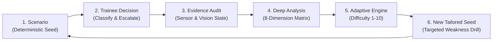

# THREATVERSE — AI-Enabled Adaptive 3D Drone & Counter-Drone Threat Simulation Trainer

[](https://github.com/Jacksonfio/drone)
[](https://threejs.org/)
[](https://github.com/Jacksonfio/drone)
[](https://github.com/Jacksonfio/drone)
[](LICENSE)

**THREATVERSE** is an enterprise-grade, browser-based **Counter-Drone Training Simulator** designed for air defense operators, security coordinators, and C-UAS trainees. It emphasizes the hardest human problem in airspace protection: **rapid, evidence-based decision-making under simulated sensor uncertainty, atmospheric degradation, and urban/rural clutter.**

---

## 🎯 10-Second Problem Statement

> **Counter-drone training today is either too expensive (live field exercises costing thousands per hour) or too simplistic (static slide decks and passive video tests). Most existing simulators focus on weapon destruction rather than the critical cognitive bottleneck: detecting, tracking, classifying, and escalating ambiguous targets when sensor data is noisy and incomplete.**
> 
> **THREATVERSE solves this by delivering an interactive, browser-based counter-drone training simulator with evidence-based temporal replay ("What Did I Know Then?") and closed-loop adaptive curriculum generation.**

---

## 💡 Core Innovation: Closed-Loop Adaptive Training

Traditional simulators operate as open-loop video players: a scenario plays, the user clicks, and a score is shown. THREATVERSE implements a continuous 6-stage closed-loop cognitive learning architecture:



1. **Scenario Generation:** Instantly generated from a deterministic Scenario Seed (`TV-CITY-00482`, `Seed: 928173`) ensuring identical, shareable conditions for comparative benchmarking.
2. **Decision Recording:** Trainee classifies target identity (`DRONE`, `NON-THREAT`, `UNKNOWN`) and selects escalation action (`MONITOR`, `VERIFY`, `ALERT`) under time pressure.
3. **Evidence Audit:** Evaluates decisions against the evidence available to the trainee at that exact second—not against hindsight ground truth.
4. **Performance Scoring:** Trainee performance is scored across 8 cognitive and procedural dimensions.
5. **Dynamic Difficulty Adjustment:** Adaptive engine calculates performance deficits (e.g. low-altitude fog classification failure) and raises or lowers difficulty (1.0 to 10.0 scale).
6. **New Scenario Synthesis:** The system autonomously spins up a targeted synthetic drill calibrated precisely to bridge the trainee's diagnosed weaknesses.

---

## ⏱️ Signature Feature: *"What Did I Know Then?"* Temporal Reconstruction

The greatest flaw in standard After-Action Reviews (AAR) is **hindsight bias**: instructors and trainees judge early decisions with knowledge of what the drone turned out to be.

| Traditional Simulator Replay | THREATVERSE Temporal Reconstruction |
|---|---|
| Replays the entire event with full god-mode clarity | Freezes the exact visual and sensor telemetry stream at the decision moment |
| Reveals ground truth immediately ("You missed a drone") | Reconstructs the trainee's optical view, sensor confidence, and radar noise |
| Fosters hindsight bias and inaccurate blame | Evaluates whether the decision was sound **given the available evidence** |
| Single scalar score (Pass/Fail) | Complete structured evidence audit log across timestamped decision steps |

### Interactive 4-Stage Reconstruction Timeline:
* **T+00:15 (First Contact):** Ambiguous radar blip on periphery (Simulated Distance: 280m, RCS: 0.04m², Fog: 65%). Action: Trainee initiated visual slew.
* **T+00:42 (Optical Acquisition):** Visual acquired at 180m; silhouette partially occluded by high-rise building edge. Trainee marked `UNKNOWN`, escalated to `VERIFY`.
* **T+01:10 (Critical Decision Point):** Target descends to 28m at 85m range, exhibiting station-keeping hover kinematics. Trainee classified `DRONE` and escalated to `ALERT`.
* **T+01:30 (Ground Truth Resolution):** Ground truth unmasked: Commercial Quadcopter carrying optical gimbal. Decision logged as **Optimal Verification Calibration**.

---

## 📊 8-Dimension Evidence-Based Performance Profile

Rather than a simple percentage score, THREATVERSE evaluates trainees across an 8-dimensional competency vector:

1. **Detection Latency (92%):** Mean time elapsed between target appearance in training airspace and initial cursor acquisition.
2. **Classification Accuracy (88%):** Correct differentiation between drones, birds, fixed-wing aircraft, and ground reflections.
3. **Decision Appropriateness (95%):** Alignment of response action (`MONITOR`, `VERIFY`, `ALERT`) with verified threat proximity and kinematics.
4. **Response Timing (84%):** Speed of escalation execution once sufficient corroborating evidence is established.
5. **Evidence Calibration (79%):** Trainee's ability to resist prematurely escalating when sensor confidence is below minimum thresholds.
6. **Uncertainty Handling (86%):** Decision robustness in degraded visual environments (dense fog, nocturnal lighting, rain).
7. **Multi-Object Tracking (73%):** Situational awareness retention when tracking simultaneous incursions or decoy wildlife.
8. **Cross-Scenario Consistency (91%):** Standard deviation of performance across identical and varying scenario seeds.

---

## ⚙️ 3-Layer AI Architecture

```text
┌────────────────────────────────────────────────────────────────────────┐
│                   THREATVERSE 3-LAYER ARCHITECTURE                     │
├────────────────────────────────────────────────────────────────────────┤
│ Layer 3: Generative AI Parameterizer                                   │
│   • Natural-Language Prompt Parser ("Create heavy fog port incursion") │
│   • Deterministic Seed Compilation (e.g. Seed #928173)                 │
│   • Reproducible Scenario Code Generation (TV-PORT-00812)              │
├────────────────────────────────────────────────────────────────────────┤
│ Layer 2: Adaptive Intelligence & Evaluation Engine                     │
│   • 8-Dimension Cognitive Performance Vector Evaluator                 │
│   • Dynamic Difficulty Engine (Calibrates on 1.0 - 10.0 scale)         │
│   • Temporal Evidence Reconstruction ("What Did I Know Then?")         │
├────────────────────────────────────────────────────────────────────────┤
│ Layer 1: Deterministic 3D Simulation & Kinematic Layer                 │
│   • Three.js WebGL 60 FPS Hardware-Accelerated Rendering Engine        │
│   • Realistic Virtual Terrain Models (City, Mountain, Village, Port)   │
│   • Simulated UAV Kinematics (Hover, Figure-8, Incursion Vectors)      │
│   • Simulated Sensor Uncertainty Shaders (Volumetric Fog, Rain, Night) │
└────────────────────────────────────────────────────────────────────────┘
```

---

## 🎛️ Dual Operating Modes: Trainee vs. Instructor Studio

THREATVERSE features a seamless top-bar toggle between two purpose-built operational interfaces:

### 1. Trainee Mode
* **Simulated Sensor Uncertainty:** Trainee operates under degraded conditions: exponential atmospheric fog, nocturnal lighting, radar noise jitter, and optical distance falloff.
* **No Ground Truth Access:** Target classification labels are masked; the trainee must rely purely on optical tracking, radar kinematics, and acoustic telemetry.
* **Active Decision HUD:** Integrated classification bar (`DRONE`, `NON-THREAT`, `UNKNOWN`) and escalation bar (`MONITOR`, `VERIFY`, `ALERT`).

### 2. Instructor Studio (Ground Truth Layer)
* **Ground Truth HUD Overlay:** Instantly projects ground truth target identities, real-time 3D coordinate vectors, exact ground speeds, and true payload configurations over the 3D viewport.
* **Live Environmental Disruption Controls:** Instructors can trigger live weather transitions, inject GPS signal degradation, induce secondary bird flock decoys, or alter UAV flight trajectories in real time.
* **Scenario Seed Generator:** Generate, test, and distribute reproducible drill seeds to cohort classes.

---

## 📈 Multi-Object Progression Ladder

To systematically develop operator competence, THREATVERSE structures scenarios into a 5-tier complexity ladder:

* **Level 1 — Single Ambient Target (Difficulty 1-2):** Clear daylight, single commercial quadcopter hovering at 80m, zero clutter, 100% sensor confidence.
* **Level 2 — Moving Target in Urban Clutter (Difficulty 3-4):** City high-rise corridor, quadcopter executing figure-8 recon at 35m altitude, moving building shadow occlusions.
* **Level 3 — Multi-Object Ambiguity (Difficulty 5-6):** Target drone flying in proximity to bird flock decoys; trainee must differentiate flapping wing kinematics from spinning quadcopter rotors.
* **Level 4 — Degraded Atmospheric Conditions (Difficulty 7-8):** Twilight or heavy precipitation with dense volumetric fog ($<120\text{ m}$ visibility); intermittent radar returns with $\pm 18\text{ m}$ position noise.
* **Level 5 — Coordinated Multi-Axis Incursions (Difficulty 9-10):** Dual simultaneous UAV threats (fixed-wing reconnaissance high + Micro-FPV drone low-level dash) combined with sensor telemetry dropouts and urban reflections.

---

## 🌍 Realistic Multi-Terrain 3D Environments

Instantly switch between four realistic virtual terrains:
* 🏙️ **Metropolis City Sector:** Dense commercial district with high-rise office towers, illuminated window grids, rooftop HVAC equipment, communication antennas with red hazard beacons, multi-lane highway grid, sidewalks, and streetlights.
* ⛰️ **Mountain Outpost & Valley:** Undulating mountain terrain with steep ridges, rocky peaks, elevated observation watchtower with searchlights, winding trails, and alpine pine forests.
* 🌾 **Rural Village & Croplands:** Agricultural landscape featuring 5 distinct 3D crop fields (golden wheat fields with furrowed ridges, rolled cylindrical hay bales, lush vineyard rows with end-posts, blooming lavender plots, mustard yellow blossom patches, and dark loam furrows), irrigation canal with stone bridge, rotating traditional windmill with lattice sailcloth blades, twin steel grain silos, 3D red farm tractor, wooden utility cart, cobblestone water well, farmhouses, homesteads, red timber barns, dry-stone walls, roadside utility poles, and fruit orchards.
* ⚓ **Coastal Industrial Port & Maritime Basin:** Deep ocean water with animated wave surface, turquoise shallow water shelf, riprap granite breakwater jetty, heavy concrete quayside dock with rubber fenders, cast-iron mooring bollards, full-scale 140m container cargo freighter ship, two 44m tall Ship-to-Shore (STS) container gantry cranes with container spreader hoists, active sweeping searchlight lighthouse, floating red & green channel navigation buoys with bobbing physics, container reach-stacker, logistics warehouses, petrochemical fuel tank farm, and high-mast terminal floodlight towers.

---

## 🚁 Customizable UAV Threat Configurations

Equipped with four customizable 3D UAV threat configurations:
* **Commercial Quadcopter (DJI Mavic / Phantom style):** 4 carbon-fiber arms, spinning rotors, landing skids, 3-axis gyro gimbal optical camera, and FAA/ICAO anti-collision strobe lights.
* **Fixed-Wing Reconnaissance UAV:** Aerodynamic surveillance glider with long wingspan, rear pusher propeller, and belly optical turret.
* **Industrial Heavy Hexacopter:** 6 radial motor arms, dual heavy-duty battery packs, and suspended threat cargo/payload module.
* **Micro-FPV Drone:** Ultra-compact high-speed racing quad with aggressive camera tilt and acrobatic evasion trajectories.

### Real-Time Customizer Controls:
* **Simulation Distance:** Adjust engagement range from **Close Inspection (40m)** to **Tactical (140m)** and **Perimeter (350m)**.
* **Flight Altitude:** Adjust operating altitude from low-level rooftop skimming (12m) to high altitude (120m).
* **Simulated Movement Models:** From stationary station-keeping hover to slow reconnaissance or high-speed evasive dash.
* **Threat Payload Selection:** EO/IR Surveillance Gimbal, Suspended Payload / Dropper, or Passive Environmental Telemetry Sensor.
* **Navigation Lighting:** High-Visibility Strobes, Military Green/Red, Stealth (Lights Dark), or Warning Amber.
* **Camera Suite:** Observer Eye-Level, Target Track Lock, Overview Camera (top-down situational awareness), and Free Orbit.

---

## 🔒 Safety & Simulation Boundary Notice

> [!IMPORTANT]
> **THREATVERSE is an educational, cognitive simulation, and training assessment tool.**
> 
> * **No Weapon Systems:** THREATVERSE contains no kinetic weapon engagement logic, live fire control systems, or offensive missile targeting.
> * **No Real-World Electronic Attack:** THREATVERSE does not model or emit radio-frequency jamming protocols, electronic countermeasures, or live cyber disruption payloads.
> * **Pure Cognitive Decision-Making:** All simulation mechanics are strictly limited to sensor interpretation, visual detection, threat classification, and procedural escalation training in virtual synthetic environments.
> * **No Operational Military Validation Claims:** Flight kinematics, sensor noise models, and atmospheric degradation are realistic approximations engineered for training pedagogy.

---

## 🚀 Quick Start Guide

### Prerequisites
* Any modern web browser with WebGL hardware acceleration enabled (Chrome, Edge, Firefox, Safari).
* Python 3.x (optional, for local hosting).

### Running Locally

```bash
# 1. Clone the repository
git clone https://github.com/Jacksonfio/drone.git
cd drone

# 2. Start a local HTTP server
python -m http.server 3000

# 3. Open your browser
# Navigate to: http://localhost:3000
```

Alternatively, open `index.html` directly in your browser.

---

## 🎮 Interactive Controls Summary

| Input / Element | Action |
|---|---|
| **Left Click + Drag** | Look around / Rotate observer camera viewpoint |
| **Right Click + Drag** | Pan camera position across training area |
| **Mouse Scroll Wheel** | Adjust camera zoom / dolly |
| **Quick Zoom (+ / -)** | Step optical PTZ magnification (1.0x - 8.0x) |
| **1-Click Drone Focus** | Instantly snap and zoom camera onto active drone |
| **Trainee / Instructor Toggle** | Switch between Trainee View and Instructor Studio with Ground Truth Layer |
| **Scenario Seed Badge** | Click to copy scenario seed for comparative cohort testing |
| **Camera Selector** | Toggle Observer Eye-Level, Target Track Lock, Overview Camera, or Free Orbit |
| **Trainee Action Bar** | Classify threat (`DRONE`, `NON-THREAT`, `UNKNOWN`) and dispatch response (`MONITOR`, `VERIFY`, `ALERT`) |

---

## 📁 Repository Structure

```text
├── index.html          # Complete THREATVERSE single-page simulation platform (Tailwind CSS + Three.js)
├── three.min.js        # Three.js WebGL 3D rendering engine (r128)
├── OrbitControls.js    # 3D camera pan, rotate, and zoom controller
└── README.md           # Master documentation and architecture guide
```

---

## 👤 Author & Maintainer
* **Repository:** [https://github.com/Jacksonfio/drone](https://github.com/Jacksonfio/drone)
* **Author:** Jackson Fio (`jacksonjp646@gmail.com`)
