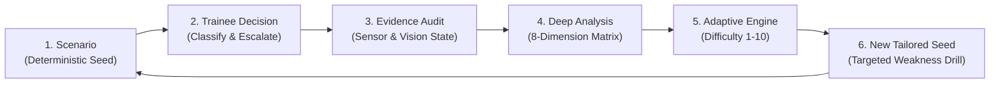

# THREATVERSE — AI-Enabled Adaptive 3D Drone & Counter-Drone Threat Simulation Trainer

[](https://github.com/Jacksonfio/drone)
[](https://threejs.org/)
[](https://github.com/Jacksonfio/drone)
[](https://github.com/Jacksonfio/drone)
[](LICENSE)

**THREATVERSE** is an interactive, browser-based **Counter-Drone Training Simulator** designed for air defense operators, security coordinators, and C-UAS trainees. It emphasizes the hardest human problem in airspace protection: **rapid, evidence-based decision-making under simulated sensor uncertainty, atmospheric degradation, and urban/rural clutter.**

---

## 🎯 Problem Statement

> **Many existing training approaches emphasize basic detection or predefined scenarios, while realistic decision-making under uncertainty, clutter, and incomplete evidence remains difficult to reproduce consistently.**
> 
> **THREATVERSE addresses this through an interactive browser-based 3D training simulator with temporal evidence reconstruction and adaptive scenario generation.**

---

## 🏛️ System Architecture

The core technical pipeline connects procedural simulation to evidence-based assessment and adaptive loop generation:

```text
                         THREATVERSE
                              │
              ┌───────────────┴───────────────┐
              │                               │
       INSTRUCTOR STUDIO                TRAINEE PROFILE
              │                               │
              └───────────────┬───────────────┘
                              ↓
                      SCENARIO DIRECTOR
                              ↓
                 PROCEDURAL SCENARIO ENGINE
                              ↓
                    ┌─────────────────┐
                    │ THREE.JS 3D     │
                    │ SIMULATOR       │
                    └────────┬────────┘
                             ↓
             ┌───────────────┼───────────────┐
             ↓               ↓               ↓
          3D VIEW          RADAR             MAP
             └───────────────┼───────────────┘
                             ↓
                     TRAINEE DECISION
                             ↓
                    DETECT → CLASSIFY
                             ↓
                    ASSESS → RESPOND
                             ↓
                      EVENT LOGGER
                             ↓
              ┌──────────────┴──────────────┐
              ↓                             ↓
        GROUND TRUTH                  TRAINEE ACTION
              └──────────────┬──────────────┘
                             ↓
                       SCORING ENGINE
                             ↓
                    AFTER-ACTION REVIEW
                             ↓
                      3D REPLAY ENGINE
                             ↓
                 "WHAT DID I KNOW THEN?"
                             ↓
                       SKILL ANALYSIS
                             ↓
                   DIFFICULTY ENGINE
                             ↓
                  ADAPTIVE NEXT SCENARIO
                             │
                             └──────────────→ LOOP
```

### The Core Technical Story:
* **Three.js** $\rightarrow$ Creates the world with real-time rendering.
* **Scenario Engine** $\rightarrow$ Creates the challenge through deterministic seeds.
* **Ground Truth** $\rightarrow$ Knows what actually happened in the simulation state.
* **Trainee Interface** $\rightarrow$ Captures human observation, classification, and response decisions.
* **Event Logger** $\rightarrow$ Records the timestamped evidence state at the exact moment of commitment.
* **Scoring Engine** $\rightarrow$ Measures performance against available evidence rather than hindsight.
* **Temporal Reconstruction** $\rightarrow$ Explains and contextualizes the decision chronologically.
* **Skill Analysis** $\rightarrow$ Identifies specific cognitive and procedural weaknesses.
* **Adaptive Engine** $\rightarrow$ Modulates difficulty and creates the next tailored drill.

---

## 🔄 Core Innovation: Closed-Loop Adaptive Training

Designed around a continuous 6-stage closed-loop learning architecture:



### Dynamic Difficulty Engine Workflow:
The engine adjusts scenario difficulty using measurable trainee performance signals such as detection latency, false-alarm frequency, decision timing, object count, visibility, and scenario complexity:

```text
Trainee Performance
        ↓
Performance Analysis
        ↓
Weakness Identification
        ↓
Difficulty Adjustment
        ↓
Scenario Generation
        ↓
New Training Session
```

---

## ⏱️ Signature Feature: *"What Did I Know Then?"* Temporal Reconstruction

The greatest obstacle in standard After-Action Reviews (AAR) is **hindsight bias**: instructors and trainees evaluate early actions with complete post-event knowledge.

| Traditional Simulator Replay | THREATVERSE Temporal Reconstruction |
|---|---|
| Replays the entire event with full god-mode clarity | Freezes the exact simulated sensor uncertainty, confidence levels, optical occlusions, and radar-state variations available at the moment of decision |
| Reveals ground truth immediately ("You missed a drone") | Reconstructs the trainee's optical view, sensor confidence, and radar state |
| Fosters hindsight bias and inaccurate blame | Evaluates whether the decision was sound **given the available evidence** |
| Single scalar score (Pass/Fail) | Complete structured evidence audit log across timestamped decision steps |

### Ground Truth & Decision Evaluation Relationship:

```text
                    SIMULATION STATE
                           │
                 ┌─────────┴─────────┐
                 ↓                   ↓
          TRAINEE VIEW          GROUND TRUTH
                 │                   │
                 ↓                   ↓
          TRAINEE DECISION ───→ SCORING ENGINE
                                      ↓
                                EVENT LOGGER
                                      ↓
                                  AAR / REPLAY
```

---

## 📊 8-Dimension Evidence-Based Performance Profile

The scoring framework evaluates trainees across eight structured dimensions rather than arbitrary percentages:

| Metric | Measures | Target Competency |
|---|---|---|
| **Detection Latency** | Time taken to identify an event | Rapid scanning and initial track lock |
| **Classification Accuracy** | Correct object classification | Distinguishing UAVs from birds, decoys, and clutter |
| **Decision Appropriateness** | Suitability of selected simulated response | Proportional escalation (`MONITOR`, `VERIFY`, `ALERT`) |
| **Response Timing** | Time between recognition and response | Decisive action without hesitation |
| **Evidence Calibration** | Alignment between confidence and available evidence | Resisting premature commitment under low confidence |
| **Uncertainty Handling** | Performance when information quality is reduced | Operation in dense fog, rain, or night conditions |
| **Multi-Object Tracking** | Ability to manage simultaneous objects | Prioritizing multiple aerial contacts in airspace |
| **Cross-Scenario Consistency** | Stability of performance across scenarios | Reproducible proficiency across different seeds |

---

## 🎲 Reproducible Scenario Seeds

Every generated scenario is associated with a **Scenario ID** and **deterministic seed** (e.g., `TV-CITY-00482`, `Seed: #928173`), allowing instructors to reproduce the same simulation configuration for controlled comparison and training assessment.

* **Shareable Seeds:** Scenario IDs and seeds can be copied and shared for reproducible training sessions.
* **Deterministic Generation:** The seed sets the virtual terrain, atmospheric weather condition, object trajectories, decoy presence, and initial sensor uncertainty values identically every time.

---

## 🎛️ Dual Operational Modes: Trainee vs. Instructor Studio

THREATVERSE features a seamless top-bar toggle between two operational views:

### 1. Trainee Mode
* **Simulated Sensor Uncertainty:** Trainees operate under authentic simulation constraints: exponential atmospheric fog, nocturnal lighting, optical distance falloff, and ambiguous silhouettes.
* **Masked Ground Truth:** Target threat identities remain hidden to test observation discipline and prevent verification bias.
* **Interactive Action HUD:** Real-time classification (`DRONE`, `NON-THREAT`, `UNKNOWN`) and escalation dispatch (`MONITOR`, `VERIFY`, `ALERT`).

### 2. Instructor Studio (Ground Truth Layer)
* **Ground Truth Layer Overlay:** Activates the ground truth overlay in the 3D viewport, revealing the simulated ground-truth state, including object position, movement parameters, classification identity, and configured training attributes.
* **Real-Time Disruption Injections:** Instructors can trigger live weather transitions (dense fog, rain), toggle decoys, or alter UAV trajectories in real time.
* **Cohort Scenario Synthesis:** Seed generator allowing instructors to specify difficulty (1.0 to 10.0 scale) and distribute identical drills across a class.

---

## 🎯 5 Demonstrable Core Capabilities

The working application directly demonstrates all five core functional features:

1. **Scenario Generation:** 1-click generation from seeds (`#928173`), instantly configuring terrains, weathers, and object counts.
2. **Trainee Decision Capture:** Real-time capture of classification (`DRONE`, `NON-THREAT`, `UNKNOWN`) and response (`MONITOR`, `VERIFY`, `ALERT`) with visual feedback.
3. **Evidence/Event Logging:** Real-time logging of trainee commits into an immutable audit table with timestamps, simulated distances, and sensor confidence levels.
4. **"What Did I Know Then?" Replay:** Interactive chronological timeline scrubber stepping through key decision points (`T+00:00`, `T+00:05`, `T+00:11`, `T+00:16`) to display the exact evidence state at each step.
5. **Adaptive Next Scenario:** 1-click deployment of tailored adaptive drills designed around flagged trainee weaknesses (e.g., atmospheric fog +40%, scaled difficulty 7.0/10).

---

## 🌍 Multi-Terrain 3D Virtual Environments

* 🏙️ **Metropolis City Sector:** Dense commercial district with 24+ varied 3D buildings (stepped corporate skyscrapers with antennas and hazard beacons, blue glass curtain towers, rooftop helipad with landing circle `[ H ]`, telecommunications mast with microwave drums, residential apartment blocks with extruded balconies, and ground-level storefronts with awnings). Features a lush **Central Public Park** (98m × 98m green turf lawn, stone perimeter coping, intersecting flagstone pathways, circular ornamental fountain / reflecting pool, 6 wooden park benches, sculpted topiary hedges, and 16+ park shade trees), tree-lined avenues with 20 boulevard trees, street planters, and green rooftop gardens ("green colour in city"). Populated with 3D vehicles on the roads (sedans in navy, red, silver; yellow city taxi; transit bus; white cargo delivery van), double-arm street lamps, 4-way traffic signals, glass bus shelters, and pedestrian zebra crosswalks.
* ⛰️ **Mountain Outpost & Valley:** Rugged alpine mountain range featuring **vibrant green-and-white terrain** generated with procedural multi-frequency harmonics and smooth vertex coloring (transitioning from lush emerald and pine valley meadows below 22m into rocky granite slate crags, culminating in **brilliant glistening white snow-capped peaks and glaciers** above 65m). Features a meandering **glacial alpine river / stream** with clear blue water and riverbed stones, crossed by a **rustic arched timber footbridge** with handrails. Densely populated with **80+ alpine conifer and pine trees** across valleys and foothill ridges, an animated flock of **7 articulated soaring birds** (eagles, hawks, and raptors riding thermals with dynamic banking and flapping wings), an elevated 20m Observation Watchtower with searchlight, a rustic Ranger Log Cabin with snow-dusted roof, stone chimney, and front veranda, a high-altitude summit telecom relay mast with a pulsing red aviation beacon, and 25+ natural 3D granite boulders.
* 🌾 **Rural Village & Croplands:** Agricultural landscape featuring 5 distinct 3D crop fields (golden wheat fields with furrowed ridges, rolled cylindrical hay bales, lush vineyard rows with end-posts, blooming lavender plots, mustard yellow blossom patches, and dark loam furrows), irrigation canal with stone bridge, rotating traditional windmill with lattice sailcloth blades, twin steel grain silos, 3D farm tractor, wooden utility cart, cobblestone water well, farmhouses, homesteads, red timber barns, dry-stone walls, roadside utility poles, and fruit orchards.
* ⚓ **Coastal Industrial Port & Maritime Basin:** Deep ocean water with animated wave surface, turquoise shallow water shelf, riprap granite breakwater jetty, heavy concrete quayside dock with rubber fenders, cast-iron mooring bollards, full-scale 140m container cargo freighter ship, two 44m tall Ship-to-Shore (STS) container gantry cranes with container spreader hoists, active sweeping searchlight lighthouse, floating red & green channel navigation buoys with bobbing physics, container reach-stacker, logistics warehouses, petrochemical fuel tank farm, and high-mast terminal floodlight towers.

---

## 🚁 Customizable UAV Threat Models

* **Commercial Quadcopter (DJI Mavic / Phantom style):** 4 carbon-fiber arms, spinning rotors, landing skids, 3-axis gyro gimbal optical camera, and FAA/ICAO anti-collision strobe lights.
* **Fixed-Wing Reconnaissance UAV:** Aerodynamic surveillance glider with long wingspan, rear pusher propeller, and belly optical turret.
* **Industrial Heavy Hexacopter:** 6 radial motor arms, dual heavy-duty battery packs, and suspended threat cargo/payload module.
* **Micro-FPV Drone:** Ultra-compact high-speed racing quad with aggressive camera tilt and acrobatic evasion trajectories.

### Customizer Controls:
* **Simulation Distance:** Adjust distance from Close Inspection (40m) to Tactical (140m) and Perimeter (350m).
* **Flight Altitude:** Adjust operating altitude from rooftop skimming (12m) to high altitude (120m).
* **Simulated Movement Models:** From stationary hover to slow reconnaissance or high-speed evasive dash.
* **Threat Payload Selection:** EO/IR Surveillance Gimbal, Suspended Payload, or Passive Environmental Telemetry Sensor.
* **Camera Suite:** Observer Eye-Level, Target Track Lock, Overview Camera (top-down perspective), and Free Orbit.

---

## 🔒 Safety & Simulation Boundary Notice

> [!IMPORTANT]
> **THREATVERSE is an educational, cognitive simulation, and training assessment tool.**
> 
> * **No Weapon Systems:** THREATVERSE contains no kinetic weapon engagement logic, live fire control systems, or offensive missile targeting.
> * **No Real-World Electronic Attack:** THREATVERSE does not model or emit radio-frequency jamming protocols, electronic countermeasures, or live cyber disruption payloads.
> * **Pure Cognitive Decision-Making:** All simulation mechanics are strictly limited to sensor interpretation, visual detection, threat classification, and procedural escalation training in virtual synthetic environments.
> * **No Operational Military Validation Claims:** Flight kinematics, sensor noise models, and atmospheric degradation are realistic approximations engineered for training pedagogy.

---

## 🚀 Quick Start Guide

### Prerequisites
* Any modern web browser with WebGL hardware acceleration enabled (Chrome, Edge, Firefox, Safari).
* Python 3.x (optional, for local hosting).

### Running Locally

```bash
# 1. Clone the repository
git clone https://github.com/Jacksonfio/drone.git
cd drone

# 2. Start a local HTTP server
python -m http.server 3000

# 3. Open your browser
# Navigate to: http://localhost:3000
```

Alternatively, open `index.html` directly in your web browser.

---

## 🎮 Interactive Controls Summary

| Input / Element | Action |
|---|---|
| **Left Click + Drag** | Look around / Rotate observer camera viewpoint |
| **Right Click + Drag** | Pan camera position across training area |
| **Mouse Scroll Wheel** | Adjust camera zoom / dolly |
| **Quick Zoom (+ / -)** | Step optical PTZ magnification (1.0x - 8.0x) |
| **1-Click Drone Focus** | Instantly snap and zoom camera onto active drone |
| **Trainee / Instructor Toggle** | Switch between Trainee View and Instructor Studio with Ground Truth Layer |
| **Scenario Seed Badge** | Click to copy scenario seed for reproducible training sessions |
| **Camera Selector** | Toggle Observer Eye-Level, Target Track Lock, Overview Camera, or Free Orbit |
| **Trainee Action Bar** | Classify threat (`DRONE`, `NON-THREAT`, `UNKNOWN`) and dispatch response (`MONITOR`, `VERIFY`, `ALERT`) |
| **AAR Timeline Slider** | Scrub chronologically through decision points to inspect evidence state |

---

## 📁 Repository Structure

```text
├── index.html          # Complete THREATVERSE single-page simulation platform (Tailwind CSS + Three.js)
├── three.min.js        # Three.js WebGL 3D rendering engine (r128)
├── OrbitControls.js    # 3D camera pan, rotate, and zoom controller
└── README.md           # Master documentation and architecture guide
```

---

## 👤 Author & Maintainer
* **Repository:** [https://github.com/Jacksonfio/drone](https://github.com/Jacksonfio/drone)
* **Author:** Jackson Fio (`jacksonjp646@gmail.com`)
